# PokeAPI - Sistema de Batalhas Pokémon

Uma API REST desenvolvida em Spring Boot que permite simular batalhas entre Pokémon.

## 🏗️ Arquitetura do Sistema



```mermaid
graph TB
    subgraph "Frontend"
        WEB[Interface Web - Thymeleaf]
        BROWSER[Navegador]
    end
    
    subgraph "API Layer"
        WC[WebController]
        BC[BattleController]
        PC[PokemonController]
    end
    
    subgraph "Service Layer"
        BS[BattleService]
        PS[PokemonService]
        RT[RestTemplate]
    end
    
    subgraph "Data Layer"
        BR[BattleRepository]
        PR[PokemonRepository]
        H2[(H2 Database)]
    end
    
    subgraph "External API"
        PAPI[PokeAPI Externa]
    end
    
    subgraph "DTOs & Entities"
        BDTO[BattleDTO]
        PDTO[PokemonDTO]
        BE[Battle Entity]
        PE[Pokemon Entity]
    end

    %% Conexões Frontend
    BROWSER --> WEB
    WEB --> WC
    BROWSER --> BC
    BROWSER --> PC

    %% Conexões Controllers -> Services
    WC --> BS
    BC --> BS
    PC --> PS

    %% Conexões Services -> Repositories
    BS --> BR
    BS --> PR
    PS --> PR
    PS --> RT

    %% Conexões External API
    RT --> PAPI

    %% Conexões Database
    BR --> H2
    PR --> H2

    %% DTOs & Entities
    BS --> BDTO
    PS --> PDTO
    BR --> BE
    PR --> PE

    classDef frontend fill:#e1f5fe
    classDef controller fill:#f3e5f5
    classDef service fill:#e8f5e8
    classDef repository fill:#fff3e0
    classDef external fill:#ffebee
    classDef dto fill:#f1f8e9

    class WEB,BROWSER frontend
    class WC,BC,PC controller
    class BS,PS,RT service
    class BR,PR,H2 repository
    class PAPI external
    class BDTO,PDTO,BE,PE dto
```

### Descrição da Arquitetura

#### 🎯 **Camada de Apresentação**
- **Interface Web**: Desenvolvida com Thymeleaf para interação via navegador
- **Controllers REST**: Endpoints para integração via API

#### ⚙️ **Camada de Negócio**
- **BattleService**: Lógica de criação e gerenciamento de batalhas
- **PokemonService**: Gerenciamento de Pokémons e integração com API externa
- **RestTemplate**: Cliente HTTP para comunicação com PokeAPI

#### 💾 **Camada de Dados**
- **Repositories**: Acesso aos dados usando Spring Data JPA
- **H2 Database**: Banco de dados em memória para persistência
- **Entities**: Mapeamento objeto-relacional

#### 🌐 **Integração Externa**
- **PokeAPI**: API externa para buscar dados dos Pokémons

#### 📋 **Fluxo de Dados**
1. **Consulta Pokémon**: Interface/API → Controller → Service → Repository → Database
2. **Busca Externa**: Service → RestTemplate → PokeAPI → Cache local
3. **Batalha**: Dois Pokémons → Lógica de combate → Resultado persistido

## 🚀 Funcionalidades

- Consulta de Pokémons
- Criação de batalhas entre Pokémons
- Sistema de combate baseado em atributos dos Pokémons
- Interface web para visualização das batalhas
- Integração com a API externa de Pokémon

## 🛠️ Tecnologias Utilizadas

- Java 17
- Spring Boot
- H2 Database
- Maven
- Spring Data JPA
- Thymeleaf (para interface web)

## ⚙️ Pré-requisitos

- Java 17 ou superior
- Maven

## 📋 Como Executar

1. Clone o repositório:
```bash
git clone https://github.com/eliasAcc25/PokeApi.git
```

2. Entre no diretório do projeto:
```bash
cd PokeApi
```

3. Execute o projeto com Maven:
```bash
mvn spring-boot:run
```

O servidor iniciará em `http://localhost:8080`

## 🎮 Como Usar

### Via Navegador

Acesse `http://localhost:8080` para usar a interface web.

### Via Postman

Uma coleção do Postman está disponível no arquivo `PokeFight_Postman_Collection.json`.

## 📚 Documentação

- Para mais detalhes sobre como jogar via browser, consulte [COMO_JOGAR_BROWSER.md](COMO_JOGAR_BROWSER.md)
- Para mais detalhes sobre como usar via Postman, consulte [COMO_JOGAR_POSTMAN.md](COMO_JOGAR_POSTMAN.md)
- Para informações sobre os testes, consulte [GUIA_TESTES.md](GUIA_TESTES.md)

## 📝 Endpoints da API

### Pokémon
- GET `/api/pokemon` - Lista todos os Pokémons
- GET `/api/pokemon/{id}` - Obtém um Pokémon específico

### Batalhas
- POST `/api/battles` - Cria uma nova batalha
- GET `/api/battles` - Lista todas as batalhas
- GET `/api/battles/{id}` - Obtém detalhes de uma batalha específica
