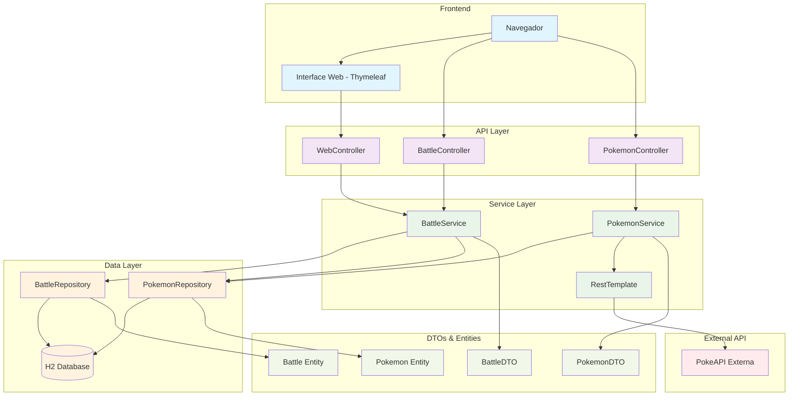

```mermaid
graph TB
    subgraph "Frontend"
        WEB[Interface Web - Thymeleaf]
        BROWSER[Navegador]
    end
    
    subgraph "API Layer"
        WC[WebController]
        BC[BattleController]
        PC[PokemonController]
    end
    
    subgraph "Service Layer"
        BS[BattleService]
        PS[PokemonService]
        RT[RestTemplate]
    end
    
    subgraph "Data Layer"
        BR[BattleRepository]
        PR[PokemonRepository]
        H2[(H2 Database)]
    end
    
    subgraph "External API"
        PAPI[PokeAPI Externa]
    end
    
    subgraph "DTOs & Entities"
        BDTO[BattleDTO]
        PDTO[PokemonDTO]
        BE[Battle Entity]
        PE[Pokemon Entity]
    end

    %% Conexões Frontend
    BROWSER --> WEB
    WEB --> WC
    BROWSER --> BC
    BROWSER --> PC

    %% Conexões Controllers -> Services
    WC --> BS
    BC --> BS
    PC --> PS

    %% Conexões Services -> Repositories
    BS --> BR
    BS --> PR
    PS --> PR
    PS --> RT

    %% Conexões External API
    RT --> PAPI

    %% Conexões Database
    BR --> H2
    PR --> H2

    %% DTOs & Entities
    BS --> BDTO
    PS --> PDTO
    BR --> BE
    PR --> PE

    classDef frontend fill:#e1f5fe
    classDef controller fill:#f3e5f5
    classDef service fill:#e8f5e8
    classDef repository fill:#fff3e0
    classDef external fill:#ffebee
    classDef dto fill:#f1f8e9

    class WEB,BROWSER frontend
    class WC,BC,PC controller
    class BS,PS,RT service
    class BR,PR,H2 repository
    class PAPI external
    class BDTO,PDTO,BE,PE dto
```
